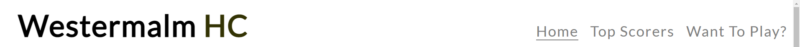
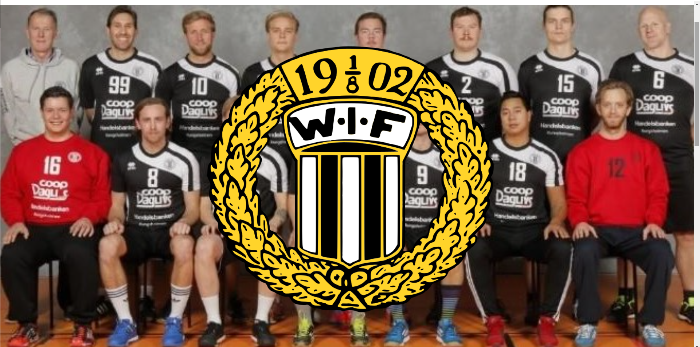
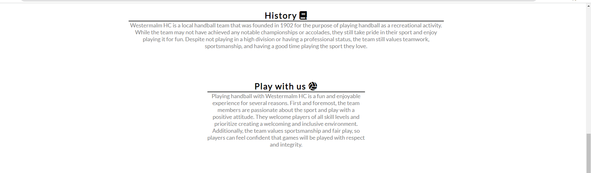
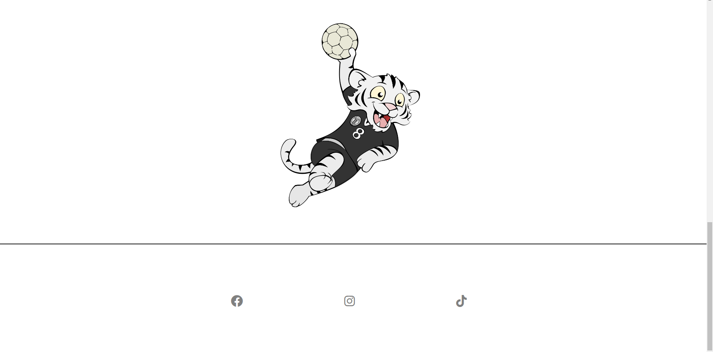
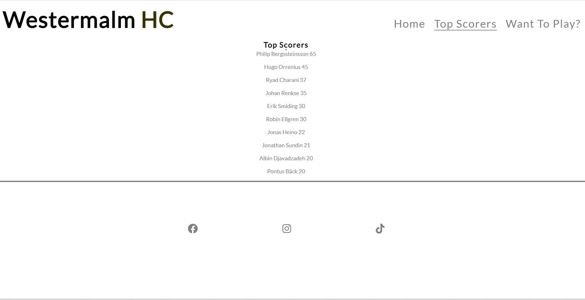
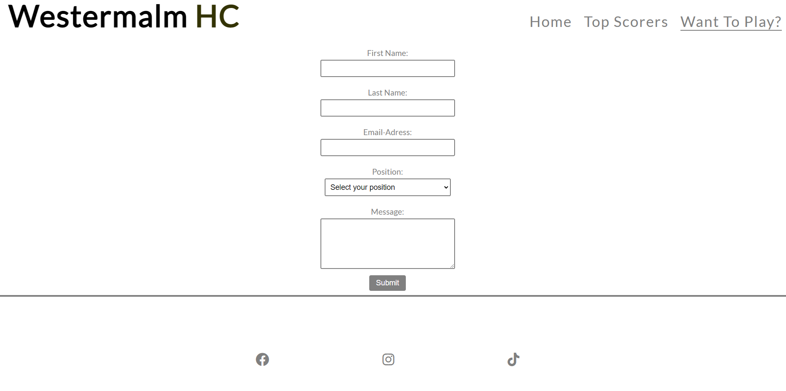

# Westermalm Hc

Westermalm Hc webpage is a page for a lokal handball team in Stockholm. 
with this page we hope to get som new members and also have news and other infomation for the team.

## Features

- Navigation Bar.
- Homepage Image.
- History and Play with us text. 
- Footer with Social media links.
- A top Scorer page.
- A Want to play page with a form.

## Navigation Bar

- Has the team name of Westermal HC, links to Home, Top Scorers and Want to play.
- All pages can be accesed from every page so that you dont need to use the back button.

## Home page image

- The home page img is a teamphoto with the team logo as a overlay.
- Both the Team photo and the team logo has animations on them to catch the attension of the viewer.

## History and Play With Us Section

-The history text will let the user read a short text about the clubs history.
-The Play with us text is a text to get the user to be interested in playing with the team.

## Footer

-The footer includes the links to all of the teams social media.
-The links are a easy way to make the user find the teams social media. 

## Top Scorers

- The Top scorers page is so that the user and team member can follow indivudual players and there accomplishment.

## Want To play?

- This is a for for new player to sign up so that the team can get in touch with them.
- The form makes it easy for bouth the team and the user to get in touch with new players.

# Testing

- The site works okey on both tablets and mobile devices but may look wierd on certain resulutions such as mobile phones.
- I have hade friends test the site and tell me about bug but got no reports of any.

### Validator Testing

- No errors were returned when passing through the official W3C validator
- No errors were found when passing through the official (Jigsaw) validator

# Deployment

- I deployed the site using Github
- https://smiding.github.io/Proj1/?fbclid=IwAR2FeBM4c6uI9LGO-zV2Y3gQ2df-irxxGhE_Bn3UrIu4VcsuQbxUVEh60lM

# Credits

## Content

- History and Play with us text i wrote myself.
* The form page i watched two Youtube tutorials
   * https://www.youtube.com/watch?v=E5MEzC0prd4
   * https://www.youtube.com/watch?v=p9qBEq-YRSc
- Icon  i got from Font Amsome
   * https://fontawesome.com/

## Media 

- Both Team Photo and Logos i got from Westermal HC FB page.
  * https://www.facebook.com/wetsermalmherr

